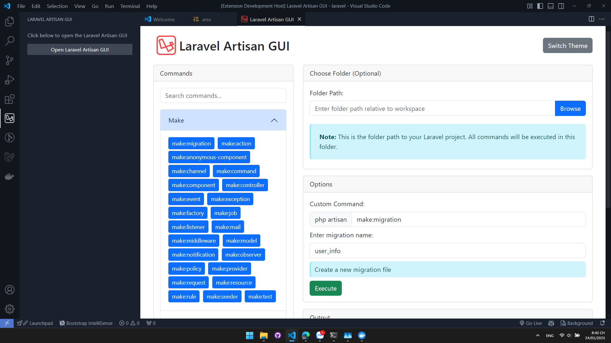

# Laravel Artisan GUI

A Visual Studio Code extension that provides a graphical user interface for running Laravel Artisan commands.

## Features

- Execute common Laravel Artisan commands with ease.
- Search for commands.
- View command descriptions.
- Execute commands in a specific folder.
- Toggle between light and dark themes.

## Installation

1. Clone the repository:
    ```sh
    git clone https://github.com/ntkhang/laravel-artisan-gui.git
    ```
2. Navigate to the project directory:
    ```sh
    cd laravel-artisan-gui
    ```
3. Install the dependencies:
    ```sh
    npm install
    ```
4. Open the project in Visual Studio Code:
    ```sh
    code .
    ```
5. Press `F5` to open a new VS Code window with the extension loaded.
6. Open the command palette (`Ctrl+Shift+P` or `Cmd+Shift+P` on macOS).
7. Run the command `Show Laravel Artisan GUI`.
8. Package the extension:
    ```sh
    npm package
    ```

## Usage
### Method 1: Command Palette
1. Open the command palette (`Ctrl+Shift+P` or `Cmd+Shift+P` on macOS).
2. Run the command `Show Laravel Artisan GUI`.
3. Use the GUI to execute Artisan commands.

### Method 2: Sidebar
1. Open the sidebar.
2. Click on the Laravel Artisan GUI icon.
3. Use the GUI to execute Artisan commands.

## Screenshots
[](screenshots/screenshot.png)

## Contributing

Contributions are welcome! Please open an issue or submit a pull request.

## License

This project is licensed under the MIT License. See the [LICENSE](LICENSE) file for details.
